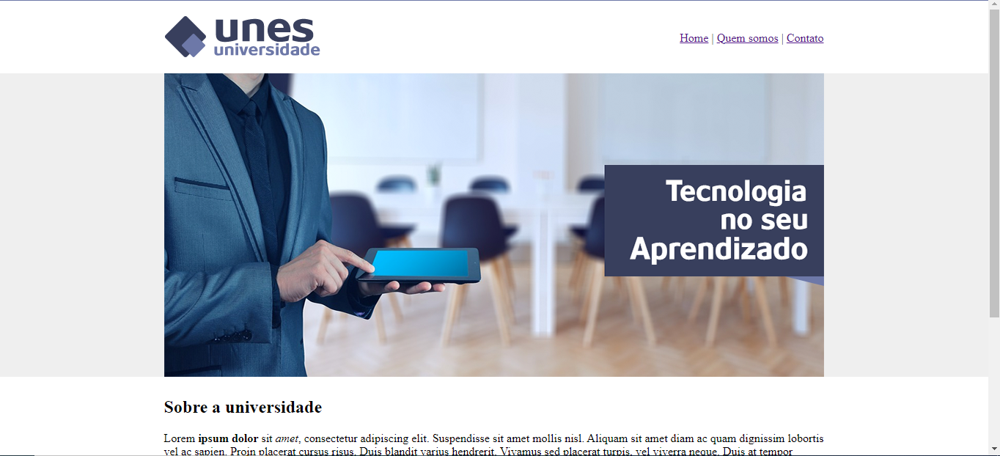

# HTML-puro

 <b>
  

<strong>UNES, site para uma universidade fictícia utilizando apenas html</strong>
  
 Este site é um exemplo de utilização do html com algumas funcionalidades básicas do mesmo.<b>
    Foi utilizado: Cabeçalho, parágrafo, listas ordenadas e não ordenadas, imagens, links,tabelas e formulários,<b>
    apenas para sintetizar a utilização do html sem o uso do CSS .

